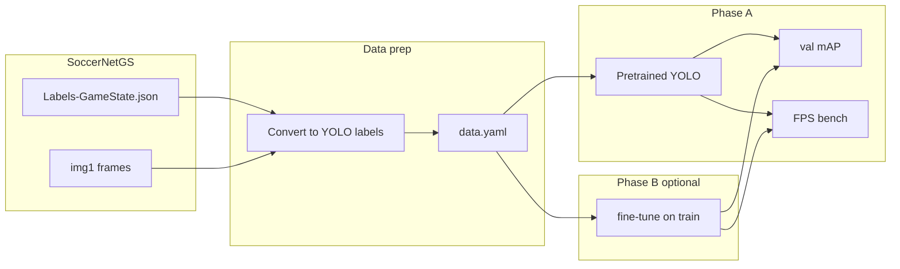

# YOLO Person Detection on SoccerNet-GS — Specification

**Status:** Draft  
**Version:** 0.1  
**Last updated:** 2026-05-27  
**Stage:** **POC — building now**

Normative spec for preparing data, evaluating accuracy, and benchmarking throughput of **single-class person detection** with YOLO on the SoccerNet Game State dataset.

> **Product stages:** [product-stages.md](../../docs/product-stages.md). This spec supports the reconstruction POC detection step. Throughput is the primary gate; mAP is a sanity check (same stance as GS-HOTA in the [GSR investigation](../soccernet-gsr/investigation.md)).

**Dataset reference:** [investigation.md](investigation.md)  
**Pipeline context:** [Game reconstruction spec](../../sportify-game-reconstruction/docs/spec/overview.md)

---

## 1. Objective and scope

### 1.1 Purpose

Isolate the **detection module** that the full SoccerNet GSR baseline runs every frame alongside tracking, ReID, OCR, and calibration (~1.1 FPS end-to-end on A100). This track answers:

- **Phase A:** How good and how fast is off-the-shelf YOLO on broadcast football?
- **Phase B (optional):** Does domain fine-tuning on SoccerNet-GS train improve person detection enough to justify training cost?

### 1.2 In scope

- Person bounding-box detection in **image space** on SoccerNet-GS public splits
- Label conversion from `Labels-GameState.json` to Ultralytics YOLO layout
- Accuracy evaluation (mAP) on the **valid** split
- Inference-only throughput benchmarking on fixed clips and hardware

### 1.3 Out of scope

- GS-HOTA and pitch-space evaluation
- Jersey, team, or role identity
- Ball detection (see [ball-tracking investigation](../../sportify-game-reconstruction/docs/investigations/ball-tracking.md))
- Multi-object tracking, ReID, OCR
- Fine-grained 4-class taxonomy (player / goalkeeper / referee / ball) — noted as future extension

### 1.4 POC gate alignment

| Metric | POC gate? | Notes |
|--------|-----------|-------|
| `inference_fps` | **Yes** (detection step) | Compare variants and hardware; compare to Sportify pipeline later |
| mAP@0.5 | No (sanity) | Record for regression; not a POC pass/fail bar |
| Full GSR 1.1 FPS | Context only | Not apples-to-apples with YOLO-only bench |

Aligns with the [throughput benchmark track](../throughput/README.md).

---

## 2. Definitions

| Term | Meaning |
|------|---------|
| `Labels-GameState.json` | Per-clip COCO-style annotation file (see [investigation.md](investigation.md)) |
| `bbox_image` | Pixel bbox `{x, y, w, h}` in COCO top-left format (1920×1080) |
| `person` | Unified detection class merging SoccerNet categories player, goalkeeper, referee, other (`category_id` 1, 2, 3, 7) |
| `eval split` | `valid` — never used for training |
| `bench clip` | Validation clip used for FPS measurement (default: `SNGS-021`) |
| **Phase A** | Eval + throughput on **pretrained** COCO weights (no training) |
| **Phase B** | Optional fine-tuning on `train`, eval on `valid` |

---

## 3. Dataset

### 3.1 Layout summary

```
SoccerNetGS/{split}/{SNGS-XXX}/
├── img1/000001.jpg … 000750.jpg   # 750 frames, 25 FPS, 1920×1080
└── Labels-GameState.json
```

Full schema: [investigation.md](investigation.md).

### 3.2 Requirements

**FR-DSET-1:** Dataset version **≥ 1.3** in `Labels-GameState.json` `info.version`.

**FR-DSET-2:** Raw data root `$SPORTIFY_DATA_ROOT/SoccerNetGS` (default `~/data/sportify/SoccerNetGS`). Download via [setup-bench.sh](../soccernet-gsr/setup-bench.sh).

**FR-DSET-3:** Split membership from `sequences_info.json`. **No clip leakage** across train and valid.

**FR-DSET-4:** Include only annotations where `supercategory == "object"` and `category_id in {1, 2, 3, 7}`.

**FR-DSET-5:** Exclude `category_id == 4` (ball), pitch (5), and camera (6) annotations.

---

## 4. Data preparation

### 4.1 Canonical YOLO layout

Stored outside git at `$SPORTIFY_DATA_ROOT/yolo-soccernet/`:

```
yolo-soccernet/
├── data.yaml
├── images/
│   ├── train/
│   └── val/
└── labels/
    ├── train/    # one .txt per image (same stem as .jpg)
    └── val/
```

Images may be symlinks or copies from `SoccerNetGS/{split}/{clip}/img1/`.

### 4.2 Conversion rules

For each person-eligible annotation with `bbox_image`:

```python
# COCO top-left (bbox_image) → YOLO normalized center
cx = (x + w / 2) / image_width
cy = (y + h / 2) / image_height
nw = w / image_width
nh = h / image_height
# One line per box in <stem>.txt:
# 0 cx cy nw nh
```

- Class index `0` = `person`
- Use `width` / `height` from the matching `images[]` entry (typically 1920 / 1080)
- Skip annotations without `bbox_image`
- Emit an empty `.txt` file for frames with no person boxes (or omit — converter must document choice; **recommend empty file** for Ultralytics compatibility)

### 4.3 `data.yaml` template

```yaml
path: /home/<user>/data/sportify/yolo-soccernet   # absolute path
train: images/train
val: images/val
names:
  0: person
nc: 1
```

Replace `path` with expanded `$SPORTIFY_DATA_ROOT/yolo-soccernet`.

### 4.4 Split assignment

| YOLO dir | SoccerNet-GS split |
|----------|-------------------|
| `images/train`, `labels/train` | `train` (57 clips) |
| `images/val`, `labels/val` | `valid` (59 clips) |

**FR-DSET-6:** Phase A eval uses only `val`. Phase B trains on `train`, evaluates on `val`.

### 4.5 Optional clip filter

For smoke runs, restrict conversion to clips listed in [manifests/valid-quick.yaml](manifests/valid-quick.yaml) (`SNGS-021`, `SNGS-022`, `SNGS-023`).

### 4.6 Sidecar metadata

Preserve clip identity outside YOLO label files (e.g. conversion manifest listing `clip_id`, source path, frame count). Clip ID must not appear inside `.txt` label lines.

---

## 5. Model and toolchain

**FR-TOOL-1:** Framework: [Ultralytics](https://docs.ultralytics.com/) (matches GSR baseline YOLOv11 in [GSR investigation](../soccernet-gsr/investigation.md)).

**FR-TOOL-2:** Use a **separate Python environment** from sn-gamestate (Python 3.9 / PyTorch 1.13). Recommend Python **3.10+** venv at `$SPORTIFY_DATA_ROOT/vendor/yolo-bench/`.

**FR-TOOL-3:** Default pretrained weights (Phase A):

| Variant | Weights | Role |
|---------|---------|------|
| Throughput | `yolo11n.pt` | Primary FPS bench |
| Accuracy reference | `yolo11m.pt` | Secondary mAP comparison |

Record exact variant and weights path in every run result.

**FR-TOOL-4:** Default input size `imgsz=640`. Optional ablation `imgsz=1280` for distant/small persons — record when used.

---

## 6. Testing and evaluation

### 6.1 Split and metrics

Evaluate on **valid** only. Metrics in **image space**:

| Metric | Source | Priority |
|--------|--------|----------|
| mAP@0.5 | Ultralytics `val` | Primary sanity |
| mAP@0.5:0.95 | Ultralytics `val` | Secondary |
| Precision / Recall @0.5 | Ultralytics `val` | Secondary |

**Non-goals:** GS-HOTA, pitch-space distance, identity attributes.

### 6.2 Eval procedure

1. Convert valid split to YOLO layout (or use cached conversion under `$SPORTIFY_DATA_ROOT/yolo-soccernet/`)
2. Run validation:
   ```bash
   yolo detect val model=<weights> data=<path>/data.yaml imgsz=640
   ```
3. Copy metrics and config snapshot to `benchmarks/results/yolo-soccernet/<timestamp>/`

### 6.3 Eval profiles

| Profile | Clips | Frames | Purpose |
|---------|-------|--------|---------|
| `smoke` | `SNGS-021` | 100 | Install / CI check |
| `valid-quick` | `SNGS-021`, `SNGS-022`, `SNGS-023` | all per clip | Quick regression |
| `valid-full` | all 59 valid clips | all | Full accuracy report |

Manifest: [manifests/valid-quick.yaml](manifests/valid-quick.yaml).

---

## 7. Throughput benchmarking

Inference-only timing, separate from mAP.

### 7.1 Metrics

| Field | Definition |
|-------|------------|
| `inference_fps` | `frames_processed / wall_clock_seconds` during predict loop |
| `wall_clock_seconds` | Timed section only |
| `frames_processed` | Count of frames inferred |
| `batch_size` | Ultralytics `batch` argument |
| `model_variant` | e.g. `yolo11n` |
| `imgsz` | Input size |

### 7.2 Procedure

1. Input: raw `img1/*.jpg` from bench clip (default `SNGS-021`) — no label I/O in timed section
2. **Warmup:** 10 frames (excluded from timing)
3. **Timed run:** full clip (750 frames) or manifest subset
4. Record GPU name, driver, batch size, `imgsz` via `nvidia-smi` or equivalent

Example (indicative):

```bash
yolo detect predict model=yolo11n.pt source=<clip>/img1 imgsz=640 batch=1 stream=True
```

Wrap with shell timing; exclude warmup and model load from `wall_clock_seconds` when possible.

### 7.3 Baseline comparison

Full GSR pipeline ~1.1 FPS ([reference.yaml](../config/reference.yaml)) includes detection + tracking + ReID + OCR + calibration. **Do not** compare YOLO-only FPS directly to 1.1 FPS as equivalent work. Report YOLO detection FPS separately; compare Sportify detection step on the same hardware later.

### 7.4 Result storage

```
benchmarks/results/yolo-soccernet/<timestamp>/
├── manifest.yaml           # copy of input manifest
├── run-result.json         # validated against schemas/run-result.schema.json
├── reference.yaml          # snapshot of benchmarks/config/reference.yaml
├── stdout.log
├── gpu.txt                 # nvidia-smi output
└── metrics.json            # Ultralytics val metrics (when eval run)
```

Schema: [schemas/run-result.schema.json](schemas/run-result.schema.json).

Example `run-result.json`:

```json
{
  "benchmark": "yolo-soccernet",
  "timestamp_utc": "20260527T120000Z",
  "manifest_name": "valid-quick",
  "phase": "bench",
  "model": {
    "variant": "yolo11n",
    "weights": "yolo11n.pt",
    "imgsz": 640,
    "batch_size": 1
  },
  "hardware": {
    "gpu": "NVIDIA GeForce RTX 3090 24GB",
    "cpu": null,
    "ram_gb": null
  },
  "metrics": {
    "clip_id": "SNGS-021",
    "frames_processed": 750,
    "wall_clock_seconds": 12.5,
    "inference_fps": 60.0,
    "map50": null,
    "map50_95": null
  },
  "status": "finished"
}
```

---

## 8. Training (Phase B — optional)

Appendix protocol. Invoke only when pretrained person mAP is insufficient for downstream tracking.

### 8.1 When to use

After Phase A eval, if mAP@0.5 on `valid-full` falls below an internally agreed threshold for MOT quality, fine-tune on SoccerNet-GS train.

### 8.2 Protocol

| Setting | Value |
|---------|-------|
| Train split | SoccerNet-GS `train` (57 clips, ~42k frames) |
| Val split | SoccerNet-GS `valid` (held out — never train) |
| Init weights | COCO-pretrained `yolo11n.pt` or `yolo11m.pt` |
| Epochs | 50 (default) |
| Batch size | 16 (tune to VRAM; record actual) |
| Image size | 640 |
| Early stopping | On val mAP@0.5, patience 10 |
| Augmentation | Ultralytics defaults (v1 — no custom broadcast aug required) |
| Output | `$SPORTIFY_DATA_ROOT/yolo-soccernet/runs/<experiment>/weights/best.pt` |

Train command (indicative):

```bash
yolo detect train model=yolo11n.pt data=<path>/data.yaml epochs=50 imgsz=640 batch=16
```

### 8.3 Post-training

Re-run §6 eval and §7 bench on the same manifest clips using `best.pt`. Record Phase B in `run-result.json` with `"phase": "train"` for the training run and `"phase": "eval"` / `"bench"` for follow-ups.

---

## 9. Acceptance criteria

| Criterion | Phase A | Phase B |
|-----------|---------|---------|
| Conversion produces one label `.txt` per image (or documented empty) | Required | Required |
| Smoke eval completes on `SNGS-021` (100 frames) | Required | Required |
| Bench records `inference_fps` + GPU metadata | Required | Required |
| Full valid mAP recorded | Recommended | Required after fine-tune |
| Train run reproducible from §8 hyperparams | N/A | Required if Phase B invoked |

---

## 10. Architecture



---

## 11. Future extensions (non-normative)

- 4-class detection: player, goalkeeper, referee, ball
- Ball class integration with [ball-tracking investigation](../../sportify-game-reconstruction/docs/investigations/ball-tracking.md)
- Compare fine-tuned vs pretrained in [throughput manifests](../throughput/manifests/soccernet-clip.yaml) when Sportify pipeline exists
- Export detections to TrackLab `bbox_ltwh` format for downstream MOT evaluation
- Populate [reference.yaml](../config/reference.yaml) with measured YOLO-only FPS baselines per GPU

---

## 12. Follow-up implementation (out of scope for this spec)

| Artifact | Purpose |
|----------|---------|
| `convert_to_yolo.py` | Labels-GameState → YOLO layout |
| `run-eval.sh` | Phase A/B validation wrapper |
| `run-bench.sh` | Throughput timing wrapper |
| `setup-bench.sh` | Ultralytics venv setup |

---

## References

- [Dataset investigation](investigation.md)
- [SoccerNet GSR investigation](../soccernet-gsr/investigation.md)
- [Throughput benchmark](../throughput/README.md)
- [Pipeline spec — player detection](../../sportify-game-reconstruction/docs/spec/overview.md#3-pipeline-step-disposition-vs-soccernet)
- Paper: [arXiv:2404.11335](https://arxiv.org/abs/2404.11335)
