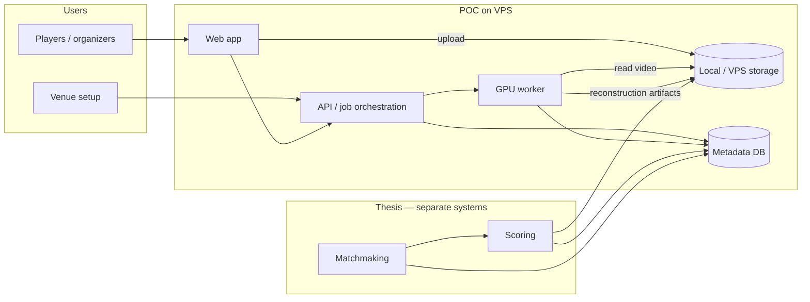

# Sportify — Product Specification (Overview)

**Status:** Draft  
**Version:** 0.2  
**Last updated:** 2026-05-24

This document specifies Sportify at the **product** level. Pipeline internals are defined in `sportify-game-reconstruction/docs/spec/`.

> **Product stages:** See [product-stages.md](../product-stages.md) for canonical POC vs thesis scope vs deferred definitions.

---

## 1. Purpose

Sportify shall enable **fair matchmaking** for amateur football using **objective skill scores** derived from match video.

The **POC** proves that game-state reconstruction can run **fast and cheap enough** to challenge the SoccerNet GSR baseline (~1.1 FPS, ~36 hours per 90-minute match) on a **VPS**, not managed cloud.

| Stage | What this spec covers |
|-------|------------------------|
| **POC** | Upload + game-state reconstruction (§2.1, §7) |
| **Thesis scope** | Scoring + matchmaking — **separate systems**; outlined in §2.3, not fully specified here |
| **Deferred** | Event detection only — §2.4; **not on roadmap** |

## 2. Scope

### 2.0 Stage definitions

| Label | Meaning | Stages |
|-------|---------|--------|
| **POC** | Building now — efficiency/cost challenge vs SoccerNet GSR | Upload, reconstruction |
| **Thesis scope** | In thesis as **separate systems**; not part of reconstruction POC | Scoring, matchmaking |
| **Deferred** | Want later; no plan, not scheduled | Event detection |

### 2.1 In scope (POC)

- User-facing upload of pretaped match video to **VPS-local storage**
- Match footage captured with **DJI Osmo 360** — see [hardware/dji-osmo-360.md](../hardware/dji-osmo-360.md)
- Venue setup data (field geometry, homography) persisted and reused — **eliminates per-frame calibration**
- Team rosters linking platform users to jersey numbers
- Automated reconstruction of player positions and identities from video
- Job lifecycle from upload through reconstruction completion
- **Measured throughput** compared to SoccerNet GSR baseline (~1.1 FPS)

### 2.2 Out of scope (POC)

- Managed cloud infrastructure (AWS S3 multipart, Batch, SQS, etc.) — **deprecated for POC**
- Live broadcast ingestion or multi-camera fusion
- Professional/broadcast-grade tracking accuracy guarantees
- In-match real-time processing (batch is acceptable; live demo may use pre-processed output — see §7.4)
- Payment, scheduling, or venue booking (unless added later as separate product areas)
- Beating SoccerNet on GS-HOTA accuracy (efficiency is the POC bar)

### 2.3 Thesis scope — scoring & matchmaking (separate systems)

**Not part of the reconstruction POC. Not deferred.** These are **in scope for the thesis** as their own systems; separate specs will follow.

| Capability | Input | Output | Depends on events? |
|------------|-------|--------|------------------|
| **Scoring** | Reconstruction artifacts | Player/team skill metrics | **No** for v1 |
| **Matchmaking** | Stored scores | Paired players/teams on demand | **No** (depends on scores) |

### 2.4 Deferred — event detection (want later, no plan)

**Not POC. Not in thesis scope as a committed deliverable.**

Event detection (passes, shots, goals, possession, etc.) is a capability we **would like** eventually. We have **no selected approach** and are **not** designing or scheduling it. Scoring v1 and matchmaking **must not** depend on events.

## 3. User Stories

### POC user stories

| ID | As a… | I want to… | So that… |
|----|-------|------------|----------|
| US-1 | Venue operator | Register field dimensions and homography once | Every match at that venue uses consistent pitch coordinates without per-frame calibration |
| US-2 | Team organizer | Define a roster (users ↔ jersey numbers) for a match | Identities in the reconstruction map to real players |
| US-3 | Player / organizer | Upload a pretaped match video via the web | The system can analyze the match without special hardware |
| US-4 | Player | See processing status after upload | I know when reconstruction is ready |
| US-5 | Researcher / evaluator | See wall-clock processing time for a full match | I can compare efficiency against SoccerNet GSR (~1.1 FPS) |

### Thesis scope user stories (scoring & matchmaking — separate systems)

| ID | As a… | I want to… | So that… |
|----|-------|------------|----------|
| US-6 | Player | View skill metrics from analyzed matches | I understand my level |
| US-7 | Player | Find opponents or teammates at a similar skill level | Matches are competitive and fun |

## 4. System Context

## 5. Functional Requirements

### 5.1 Venue setup

- **FR-V1:** The system shall store per-venue field length/width and goal dimensions (physical units).
- **FR-V2:** The system shall store a homography matrix (or equivalent) computed at setup, not per match or per frame.
- **FR-V3:** Homography shall be available to the reconstruction pipeline as read-only venue input.
- **FR-V4:** The POC shall **not** run SoccerNet-style per-frame pitch localization or camera calibration when venue homography is available.

### 5.2 Team & roster

- **FR-T1:** The system shall accept a roster: mapping of platform user identity to jersey number for a given match.
- **FR-T2:** The system shall accept squad size (number of players per team).
- **FR-T3:** Reconstruction shall resolve detected players to roster identities; association uses ReID + jersey OCR when a track is not yet mapped to a `user_id` (see pipeline spec).

### 5.3 Video upload

- **FR-U1:** Users shall upload pretaped MP4 match video through a web interface. Expected source: **DJI Osmo 360** flat export (HEVC).
- **FR-U2:** Upload shall support large files (target: up to ~20 GB, H.265/H.264). Actual file size depends on Osmo recording settings — see [hardware/dji-osmo-360.md](../hardware/dji-osmo-360.md).
- **FR-U3:** Upload shall land on **VPS-accessible storage** (local disk or VPS-attached volume); the application server may stream or proxy chunks — direct-to-cloud multipart upload is **not required** for POC.
- **FR-U4:** Upload shall support progress and retry where possible.
- **FR-U5:** On successful upload completion, the system shall create a processing job record.

### 5.4 Reconstruction (delegated to pipeline spec)

- **FR-R1:** Given video, venue data, and roster, the pipeline shall produce time-series player positions and linked user identities.
- **FR-R2:** Output cadence shall be configurable (every frame or every *k* frames).
- **FR-R3:** The pipeline shall report **effective FPS** (frames processed / wall-clock time) for the full job.
- **FR-R4:** Heavy identity steps (jersey OCR, ReID) shall be **conditional** — not required on every frame when the track is already mapped to a `user_id`.

### 5.5 Job lifecycle

- **FR-J1:** Each upload shall have states including at minimum: `uploading`, `queued`, `processing`, `succeeded`, `failed`.
- **FR-J2:** Failures shall be persisted with a reason accessible to the user or operator.
- **FR-J3:** Completed jobs shall record `started_at`, `finished_at`, and derived throughput metrics.

## 6. Non-Functional Requirements

| ID | Requirement |
|----|-------------|
| NFR-1 | **VPS-first (POC):** Run upload, storage, API, and GPU worker on a rented VPS — no managed cloud dependency during experiments. |
| NFR-2 | **Efficiency (POC):** End-to-end throughput shall ** materially exceed** SoccerNet GSR baseline (~1.1 FPS); ~90-minute match processing shall target **hours, not ~36 hours**. Exact target set during implementation. |
| NFR-3 | **Cost awareness:** POC experiments shall incur predictable VPS rental cost only — no surprise cloud egress or per-request billing. |
| NFR-4 | **Integrity:** Uploaded files shall be verified on completion (size, optional checksum). |
| NFR-5 | **Modularity:** Scoring and matchmaking shall consume reconstruction artifacts without coupling to upload or reconstruction internals. |
| NFR-6 | **Honest demo:** Presentation may use pre-processed output if live speed is insufficient; measured throughput must still be reported. |

## 7. Infrastructure (POC — VPS)

### 7.1 Why not cloud

Managed cloud was considered for a production path but is **out of scope for the POC**. A VPS allows:

- Unrestricted experiment iteration without AWS billing overhead
- Single-machine simplicity (API + storage + GPU on one host)
- Predictable monthly cost for thesis-scale work
- Potential use of the **same VPS for final presentation**

### 7.2 Upload path

1. Browser uploads video to the web/API service (or dedicated upload endpoint) on the VPS.
2. File is written to VPS storage (local filesystem or attached volume).
3. API creates a processing job record pointing at the stored path.

### 7.3 Processing path

1. Job queue (in-process, Redis, or simple DB polling) picks up pending jobs.
2. **Pipeline worker** (GPU process on the same VPS) reads video from local path.
3. Worker runs reconstruction, writes artifacts to output directory.
4. Worker updates job status and throughput metrics in metadata store.

### 7.4 Presentation path

If live reconstruction is too slow for a demo slot:

- Pre-process representative match footage before the presentation.
- During demo, show the UI/progress **as if** processing live while displaying the pre-computed artifact.
- Report **actual measured throughput** separately — do not claim real-time if pre-processed.

### 7.5 Scoring & matchmaking (thesis scope — separate systems)

Not part of the reconstruction POC. **In scope for the thesis** as separate systems.

- Scoring reads reconstruction artifacts and writes score records.
- Matchmaking reads stored scores on demand.
- Neither is part of the reconstruction pipeline or upload hot path.

## 8. VPS Stack (Recommended POC)

| Component | Role |
|-----------|------|
| **Local filesystem / volume** | Raw video and pipeline output artifacts |
| **Web + API** (FastAPI, Node, etc.) | Upload, job metadata, status UI |
| **SQLite or Postgres** | Uploads, jobs, venues, rosters |
| **Job runner** | In-process queue, Celery, or simple worker loop |
| **GPU worker** | Pipeline container or venv on VPS GPU instance |
| **Docker (optional)** | Reproducible worker environment |

Cloud equivalents (S3, SQS, Batch) are documented only as a **future production direction**, not POC requirements.

## 9. Data Entities (Product Level)

| Entity | Stage | Description |
|--------|-------|-------------|
| `Venue` | POC | Field dimensions, goal dimensions, homography, setup timestamp |
| `User` | POC | Platform player identity |
| `Roster` | POC | Match-scoped list of `(user_id, jersey_number)` per team |
| `Upload` | POC | Video file reference, size, codec, uploader, status |
| `Job` | POC | Processing run: links upload + venue + roster → reconstruction artifacts; includes throughput metrics |
| `ReconstructionArtifact` | POC | Stored output (e.g. JSON time series) — schema in pipeline spec |
| `Score` | Thesis — separate system | Player/team skill metrics |
| `MatchRequest` | Thesis — separate system | Matchmaking query/result |

## 10. Success Criteria (POC)

1. A user can upload a pretaped match video through the web to VPS storage.
2. A GPU worker on the same VPS produces reconstruction output using stored venue homography and match roster.
3. Output associates detected players with **user identities** via jersey numbers, with positions in field coordinates.
4. Job status is visible from upload through completion or failure.
5. **Wall-clock throughput materially exceeds SoccerNet GSR ~1.1 FPS** on representative amateur match footage, with methodology documented.
6. Per-frame pitch localization and camera calibration are **not** run when venue homography is present.

## 11. Open Decisions (Product)

| # | Topic | Options / notes |
|---|--------|-----------------|
| 1 | VPS provider & GPU tier | Hetzner, OVH, Lambda Labs, etc. — cost vs GPU memory |
| 2 | GPU trigger | Automatic on upload vs manual start (VPS cost vs UX) |
| 3 | Auth & accounts | How users, teams, and venues are modeled in the web app |
| 4 | Output retention | How long raw 20 GB videos are kept vs artifacts only |
| 5 | Demo mode | Pre-processed fallback UX for presentation |
| 6 | Throughput target | Exact FPS / hours-per-match goal once baseline pipeline exists |

## 12. Document Map

| Document | Path |
|----------|------|
| **Product stages (canonical)** | `docs/product-stages.md` |
| Product overview | `docs/overview.md` |
| Match camera | `docs/hardware/dji-osmo-360.md` |
| This spec | `docs/spec/overview.md` |
| Pipeline overview | `sportify-game-reconstruction/docs/overview.md` |
| Pipeline spec | `sportify-game-reconstruction/docs/spec/overview.md` |
