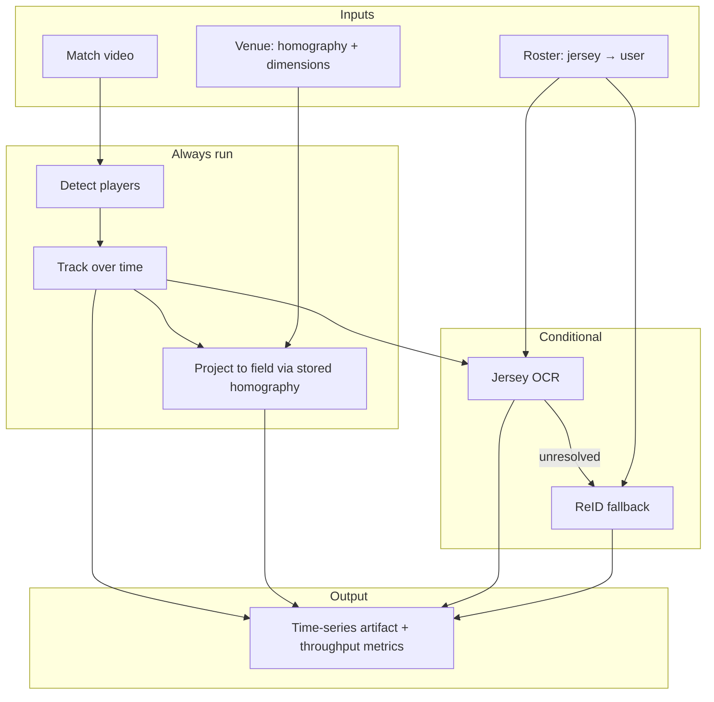
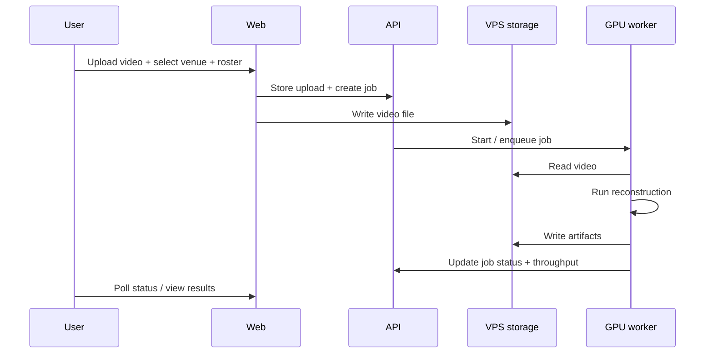

# Game Reconstruction Pipeline — Overview

**Status:** Active design  
**Last updated:** 2026-05-24  
**Repo:** `sportify-game-reconstruction`  
**Stage:** **POC — building now**

> **Product stages:** This repo is the **reconstruction POC only**. Scoring and matchmaking are **thesis scope — separate systems**. Event detection is **deferred**. See [product-stages.md](../../docs/product-stages.md).

This document describes the **game reconstruction pipeline** only: turning pretaped match video plus venue and team context into structured spatiotemporal state. It does not cover scoring, matchmaking, or the full Sportify web product (see [Sportify product overview](../../docs/overview.md)).

Prior documentation from other repositories is **not authoritative**. This repo defines the pipeline from scratch.

---

## Purpose

Given a pretaped amateur football match (elevated side view), produce a time series of:

- **Players** — field position and platform **user identity** (via jersey number → roster lookup)

This is the **sole POC deliverable of this repo**.

The POC **challenges SoccerNet Game State Reconstruction** on **cost and efficiency at mass scale**. SoccerNet's baseline runs at ~**1.1 FPS** end-to-end (~**36 hours** for a ~90-minute match on an A100). That throughput is the primary bar to beat — not GS-HOTA accuracy.

| Downstream stage | Commitment | Relationship to this repo |
|------------------|------------|---------------------------|
| **Scoring** | Thesis scope — **separate system** | Reads reconstruction artifacts; separate spec/repo TBD |
| **Matchmaking** | Thesis scope — **separate system** | Reads scores; separate spec/repo TBD |
| **Event detection** | Deferred — want later, no plan | Not on roadmap; not a v1 scoring dependency |

See [Product stages](../../docs/product-stages.md) and [Thesis architecture](../../docs/overview.md#thesis-architecture).

---

## vs SoccerNet GSR: Eliminated and Conditional Steps

SoccerNet GSR runs six modules every frame. Our fixed-camera amateur context allows a leaner design:

| Step | SoccerNet | POC | Notes |
|------|-----------|-----|-------|
| Player detection | Always | **Always** | Core — every processed frame |
| Pitch localization (TVCalib) | Always (~2.9 FPS) | **Eliminated** | Venue homography stored at setup |
| Camera calibration (TVCalib) | Always (~7.6 FPS) | **Eliminated** | Reuse stored homography per match |
| Multi-object tracking | Always | **Always** | Maintain track continuity |
| Re-identification (PRTReID) | Always (~14.5 FPS with tracking) | **Conditional** | When jersey OCR cannot resolve identity |
| Jersey OCR (MMOCR) | Always (~3.8 FPS) | **Conditional** | When number likely visible / identity not yet stable |
| Tracklet post-processing | Always | **Always** | Majority vote, roster merge — lightweight |
| Event detection | N/A in GSR paper scope | **Out of scope** | Deferred product-wide |

**Eliminated** steps are never run in the POC when venue homography exists.

**Conditional** steps run only when upstream state requires them (e.g. unresolved jersey, new track). Exact triggers are open design items in [spec/overview.md](spec/overview.md).

---

## Inputs

### Match video

- **Camera:** DJI Osmo 360 — see [hardware doc](../../../docs/hardware/dji-osmo-360.md)
- Format: MP4 (HEVC / H.265 from flat Single Lens or Boost export)
- Source: pretaped, elevated fixed side view (camera mounted for the match)
- Size: potentially very large (e.g. up to ~20 GB target per product spec; depends on recording settings)
- Ingestion: uploaded to **VPS storage**; worker reads by local path

### Venue data (stored once per venue)

Computed at **setup**, not every match or every frame:

| Field | Description |
|-------|-------------|
| Field dimensions | Length and width in physical units (meters) |
| Goal dimensions | Width and height (meters) |
| Homography | Camera image → pitch plane mapping |

Homography is **input** to reconstruction, not an output of each run. This is the main efficiency win over SoccerNet.

### Team data (per match)

| Field | Description |
|-------|-------------|
| Squad size | Number of players per team |
| Roster | Table mapping **jersey number → user identity** for each team |

Team membership is implied by identity through the roster, not emitted as a separate per-frame field.

---

## Outputs

Emitted **every frame** or **every k frames** (configurable):

### Per player instance

| Field | Description |
|-------|-------------|
| `user_id` | Platform identity from roster (via jersey resolution) |
| `x`, `y` | Position on the pitch in venue field coordinates (meters) |
| `z` | Optional height; omit or zero if not estimated in POC |

### Job metrics (POC)

| Field | Description |
|-------|-------------|
| `effective_fps` | Frames processed / wall-clock seconds |
| `wall_clock_seconds` | Total job duration |
| `frames_processed` | Count of input frames (or stride-adjusted equivalent) |

Artifacts are written to VPS storage and referenced by job metadata.

---

## High-Level Processing Flow

Exact step boundaries, models, and conditional triggers are **not finalized**; see [spec/overview.md](spec/overview.md).

---

## Execution Model (POC)

| Aspect | Decision |
|--------|----------|
| Runtime | **Batch** — process entire match after upload |
| Infrastructure | **VPS** — API, storage, and GPU worker on same host |
| Orchestration | Simple job queue (in-process, Redis, or DB polling) |
| Storage | Local filesystem or VPS-attached volume |
| Cloud | **Out of scope** for POC — no S3/Batch/SQS dependency |

The upload web app does **not** run inference. A **pipeline worker** with read access to stored video runs reconstruction and writes outputs.

For thesis presentation, if live speed is insufficient, demo may show pre-processed output while reporting measured throughput separately (see [product spec](../../docs/spec/overview.md#74-presentation-path)).

---

## Relationship to Sportify Platform

---

## Scope Boundaries

| Label | What |
|-------|------|
| **POC (this repo)** | Efficient batch reconstruction — see [In scope](#in-scope) |
| **Thesis scope** | Scoring, matchmaking — **separate systems**; not in this repo |
| **Deferred** | Event detection only — not scheduled, no approach |

### In scope

- Batch reconstruction from pretaped side-view video
- Use of precomputed venue homography (**SoccerNet calibration eliminated**)
- Identity association via conditional jersey OCR + conditional ReID + roster table
- **Throughput measurement** vs SoccerNet ~1.1 FPS baseline
- VPS-friendly artifact layout

### Thesis scope (not this repo — separate systems)

| Stage | Status |
|-------|--------|
| **Scoring** | In thesis scope; consumes reconstruction artifacts; v1 does not require events |
| **Matchmaking** | In thesis scope; consumes scores |

### Out of scope (this repo)

- Per-frame pitch localization and camera calibration (SoccerNet Modules 2–3)
- Managed cloud upload/processing (AWS, etc.)
- Venue homography **computation** tool (may live elsewhere; output is consumed here)
- Real-time or streaming inference (batch only; demo may use pre-processed data)
- Fixed camera hardware integration
- **Scoring** and **matchmaking** implementation (separate thesis systems)

### Deferred (not on roadmap)

- **Event detection** — passes, shots, goals, etc. Want eventually; **no approach selected**; **not a dependency** for scoring v1 or matchmaking

---

## Design Principles

1. **Beat ~1.1 FPS** — Mass scale is impossible at SoccerNet throughput; efficiency is the POC thesis.
2. **Eliminate redundant compute** — No per-frame calibration when homography is known.
3. **Conditional expensive steps** — OCR and ReID are not default per-frame paths.
4. **One clear artifact contract** — Downstream systems depend on documented JSON, not internal step files.
5. **Swappable components** — Detection, tracking, OCR, etc. are replaceable if inputs/outputs stay stable.
6. **Fail visibly** — Jobs report failure with enough context to retry or debug.
7. **Measure honestly** — Report wall-clock FPS; demo pre-processing is allowed but must not inflate claims.

---

## Current Status

| Area | Status |
|------|--------|
| Problem statement & I/O | Defined |
| SoccerNet comparison & step disposition | Defined |
| VPS execution model | Defined |
| Internal step graph & conditional triggers | Conceptual only |
| Ball tracking | [Phase 1 spike](investigations/ball-tracking.md) — 2D only, target ≥65% consistency; not in POC spec |
| Schemas | Draft at spec level |
| Implementation | Not started in this repo |

---

## Related Documents

| Document | Path |
|----------|------|
| Pipeline specification | [spec/overview.md](spec/overview.md) |
| Ball tracking investigation | [investigations/ball-tracking.md](investigations/ball-tracking.md) |
| Sportify product overview | [../../docs/overview.md](../../docs/overview.md) |
| Sportify product spec | [../../docs/spec/overview.md](../../docs/spec/overview.md) |
